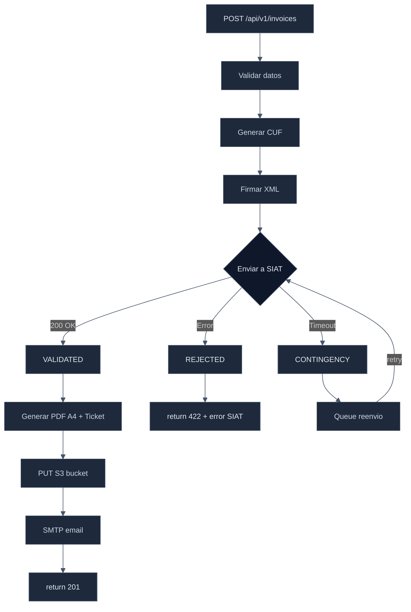
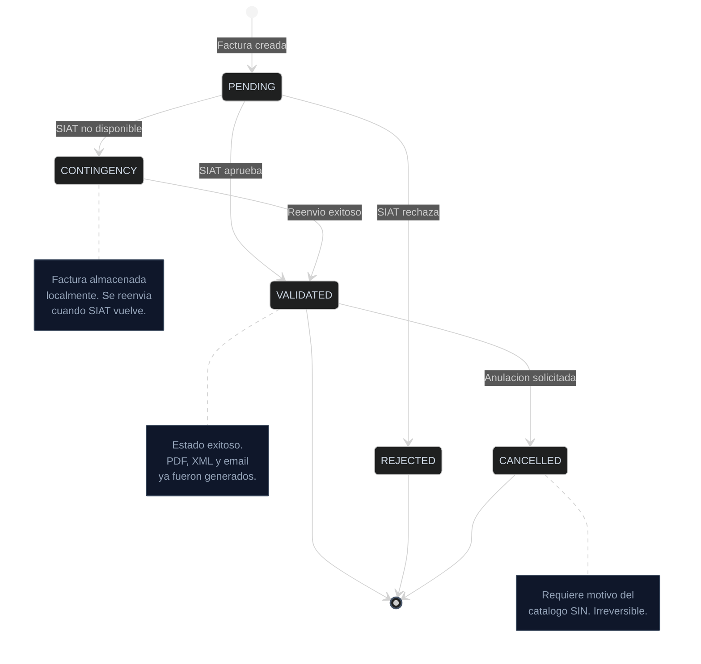

## Flujo completo

Cuando creas una factura a traves de la API, este es el proceso interno:

---

## 1. Validacion de datos

La API valida:
- **Campos requeridos**: NIT, razon social, metodo de pago, detalles
- **Formato de NIT**: 7-15 digitos, algoritmo de verificacion SIN
- **Codigos SIAT**: Actividad economica, producto SIN, unidad de medida
- **Montos**: Positivos y coherentes (subtotal = cantidad x precio - descuento)

Si la validacion falla, se retorna HTTP 400 con detalle del error.

## 2. Generacion del CUF

El **CUF** (Codigo Unico de Factura) es el identificador unico de cada factura ante el SIN. Se genera combinando:
- NIT del emisor
- Fecha y hora de emision
- Sucursal y punto de venta
- Numero de factura
- Tipo de documento
- CUFD vigente

El CUF es irrepetible y actua como "firma" de la factura.

## 3. Firma digital

El XML de la factura se firma con el **certificado digital** del emisor (emitido por el SIN). La firma garantiza la integridad y autenticidad de la factura.

## 4. Envio al SIAT

La factura firmada se envia al SIAT para validacion. Posibles resultados:

| Resultado | Accion |
|-----------|--------|
| **VALIDATED** | Factura valida. Se procede a generar PDF. |
| **REJECTED** | El SIAT rechazo la factura. Se retorna el error. |
| **SIAT no disponible** | Se activa automaticamente modo contingencia (si esta configurado). |

## 5. Generacion de documentos

Una vez validada, se generan automaticamente:
- **PDF A4** - Formato estandar para impresion
- **Ticket 80mm** - Para impresoras termicas/POS
- **XML firmado** - Documento fiscal oficial

## 6. Almacenamiento

Todos los archivos se almacenan en S3 con URLs publicas permanentes. Las facturas son **inmutables** una vez emitidas.

## 7. Notificacion por email

Si se proporciono un email del cliente, se envia automaticamente:
- PDF A4 adjunto
- Ticket adjunto (si `isTicket: true`)
- XML adjunto
- Link de descarga publica

---

## Estados de una factura

| Estado | Descripcion | Final? |
|--------|-------------|--------|
| `PENDING` | Creada, pendiente de envio al SIAT | No |
| `VALIDATED` | Validada por el SIAT — tiene validez fiscal | Si (a menos que se anule) |
| `REJECTED` | Rechazada por el SIAT — revisar errores | Si |
| `CANCELLED` | Anulada ante el SIAT — irreversible | Si |
| `CONTINGENCY` | Emitida offline, en cola de reenvio | No |

<Tip>
  Puedes consultar el estado actual de cualquier factura con
  `GET /api/v1/invoices/{id}/status`. Ver [Estado de factura](/api-reference/invoice-status).
</Tip>
